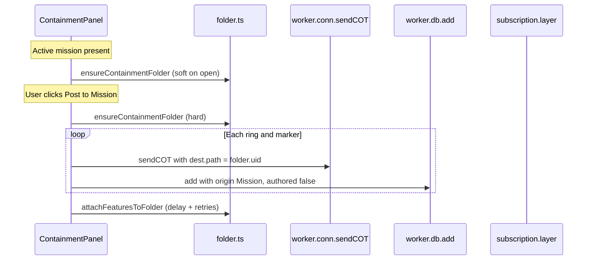

# DataSync Mission Folders (CloudTAK Plugins)

How to create a folder in an active DataSync mission and file CoTs into it from a CloudTAK web plugin.

**Reference implementation in this repo:**

- [`lib/folder.ts`](../lib/folder.ts) — ensure folder, dest helpers, delayed attach backup
- [`lib/ContainmentPanel.vue`](../lib/ContainmentPanel.vue) — `softEnsureFolder()` + `confirm()` / `publishToFolder()`

## Concepts

| Term | Meaning |
|------|---------|
| **Mission folder** | A **UID** mission layer (`Subscription.layer`) — Mission → Layers |
| **Feature `path`** | Profile / My Features path (often `'/'`) — **not** the mission folder |
| **Dest `path`** | On CoT `properties.dest[]`, `path` is the **mission layer UID** (files on ingest) |
| **attachFeatures** | Move existing mission CoT UIDs under a layer (racy if called too soon) |

Always use `type: 'UID'`. TAK only returns filed UIDs for UID layers, not `GROUP`. Folders are created at mission root unless you pass `parentUid`.

## What went wrong with attach-only

Earlier approach:

1. `worker.db.add(feat, { authored: true })` → websocket publish
2. `SubscriptionFeature.update` sets `dest: [{ 'mission-guid' }]` **with no folder**
3. Immediate `layer.attachFeatures(folderUid, uids)` → TAK **500** (CoT not in mission contents yet)

Result: folder created, ring/markers stuck at mission root. CloudTAK also surfaces those 500s as JSON toasts.

**Current approach:** file with dest `path` at send time; use delayed per-UID `attachFeatures` only as backup.

## End-to-end flow (this plugin)



## Helpers exported from `lib/folder.ts`

| Export | Role |
|--------|------|
| `CONTAINMENT_FOLDER` | Display name `"Containment"` |
| `findLayerByName(layers, name)` | Top-level name match |
| `ensureContainmentFolder(sub)` | List → reuse or `create({ name, type: 'UID' })` → re-list for `uid` |
| `missionFolderDest(guid, folderUid)` | `[{ 'mission-guid', path: folderUid, after: '' }]` |
| `withMissionFolderDest(feat, guid, folderUid)` | Deep-clone feature with that dest |
| `attachFeaturesToFolder(sub, folderUid, uids)` | 800ms delay, then per-UID attach with up to 6 retries |
| `sleep(ms)` | Shared delay helper |

Do **not** trust `layer.create()`’s return value alone (TAKItem-wrapped). Re-list and find by name.

## Soft-ensure when mission is active

In `ContainmentPanel.vue`: watch active mission; create folder if missing; failures only `console.warn` so missing write permission does not block the panel.

```ts
async function softEnsureFolder(): Promise<void> {
    if (!mapStore.mission) return;
    try {
        await ensureContainmentFolder(mapStore.mission);
    } catch (err) {
        console.warn('Failed to ensure Containment mission folder', err);
    }
}

watch(mission, () => { void softEnsureFolder(); }, { immediate: true });
```

## Post to Mission (`confirm`)

```ts
import { OriginMode } from '../../../src/base/cot.ts';
import {
    ensureContainmentFolder,
    withMissionFolderDest,
    attachFeaturesToFolder
} from './folder.ts';

const folder = await ensureContainmentFolder(mapStore.mission);
const missionGuid = mapStore.mission.guid;
const postedUids: string[] = [];

async function publishToFolder(feat: Feature): Promise<void> {
    // 1. Network: dest.path = layer UID (atomic filing; same idea as ETL)
    const wire = withMissionFolderDest(feat, missionGuid, folder.uid);
    mapStore.worker.conn.sendCOT(wire);

    // 2. Local mission store only — authored:true would re-send dest without path
    await mapStore.worker.db.add({
        ...feat,
        origin: { mode: OriginMode.MISSION, mode_id: missionGuid }
    }, { authored: false });

    postedUids.push(String(feat.id));
}

// ... buildRingFeature / buildContainmentMarker → publishToFolder(...)

// 3. Backup if dest.path was ignored (best-effort; Post still succeeds)
try {
    await attachFeaturesToFolder(mapStore.mission, folder.uid, postedUids);
} catch (attachErr) {
    console.warn(attachErr);
    error.value = attachErr instanceof Error ? attachErr.message : String(attachErr);
}
```

### Why not `db.add(..., { authored: true })` for folder filing?

That path goes through `SubscriptionFeature.update`, which **overwrites** `dest` to `{ 'mission-guid' }` only. Folder is lost. Send with `conn.sendCOT` + local `authored: false` avoids that.

Leave Feature GeoJSON `path: '/'` as-is — that is not the mission folder.

## Attach backup details

`attachFeaturesToFolder`:

- Initial delay **800ms** (websocket ingest is async)
- One UID at a time (matches Mission → Layers drag-drop)
- Up to **6** attempts, backoff `300 * (i + 1)` ms
- Partial failure → throws; panel shows message that some items may remain at mission root

Do **not** poll with `feature.list({ refresh: true })` right after local add — refresh replaces Dexie from the server and can wipe features not yet ingested.

## Copying into another plugin

1. Copy [`lib/folder.ts`](../lib/folder.ts) (or rename `CONTAINMENT_FOLDER` / `ensureContainmentFolder`).
2. Soft-ensure on active mission.
3. On write: ensure folder → `withMissionFolderDest` + `sendCOT` → `db.add` with `OriginMode.MISSION` / `authored: false`.
4. Call `attachFeaturesToFolder` as delayed backup; treat attach failure as warning, not a failed post.
5. Lint from host: `cd ~/CloudTAK/api/web && npx eslint --config eslint.config.js ./plugins/<slug>/`

## Related CloudTAK sources

- `api/web/src/base/subscription-layer.ts` — list / create / attachFeatures
- `api/stateless/routes/connection-layer-cot.ts` — `cot.addDest({ mission, path: layerUid })`
- `api/stateful/lib/connection-web.ts` — `CoTParser.from_geojson` preserves dest
- Mission UI: Mission → Layers (drag onto folder = attachFeatures)
